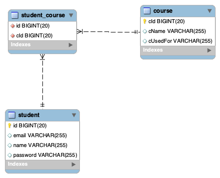
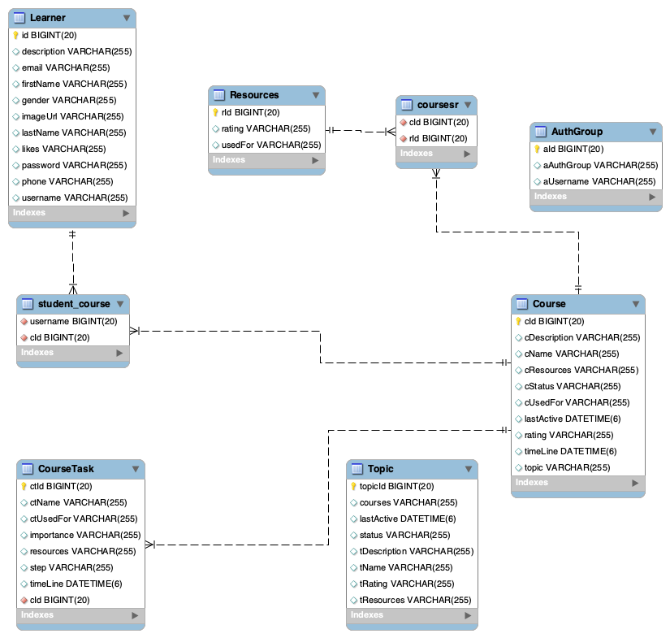

# SpringBootCrudSkillDriver / LearnMap
## This project was initially for the active learner.
* create, Read, Update, Delete
    * Selfpaced courses, that you find or create
* Other users would  be to create quick guides for dev teams to share to project managers or staff for 
    tool configurations.
  
___

### At this time this project can:
* Create, Read, Update, Delete Users/Students
* Create, Read, Update, Delete Courses
* login/logout page

### Next Down the Pipeline:
* Student cant add class, and create class tasks
* Courses will have resources
* Courses and CoursesTasks will have timelines
* CourseTasks/Courses will have Status
* You can Share/Print courses out
* Others can join your course
* Courses can have a mentor
* more on [Trello Board](https://trello.com/b/l3QAyLgS/agile-sprint-board-case-study)

---
### Current DB

#### target/Prior DB

---
### About
* Java 11
* Spring boot virsion: 2.5.1
* db: Mariadb

